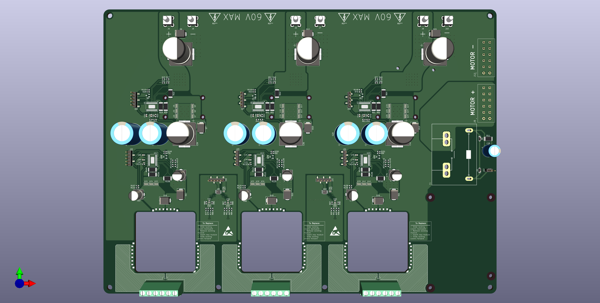
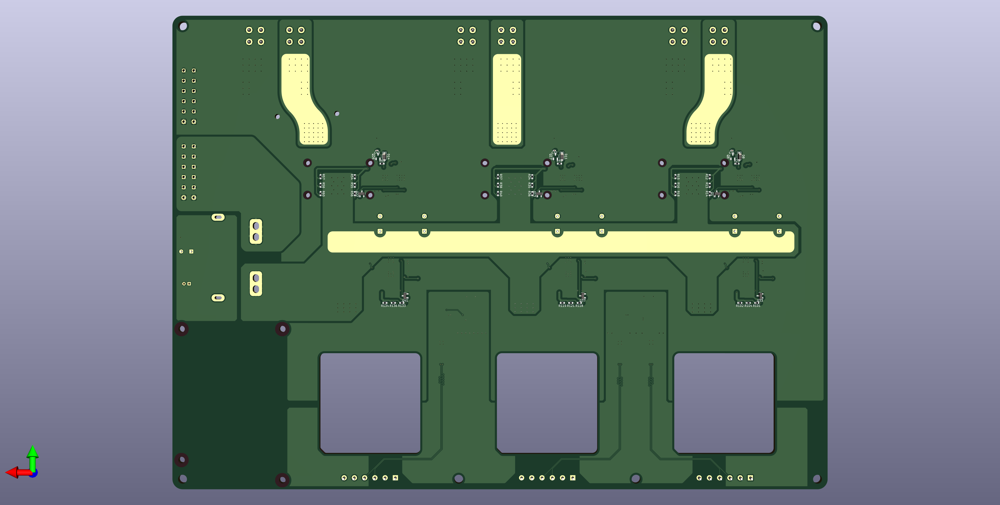
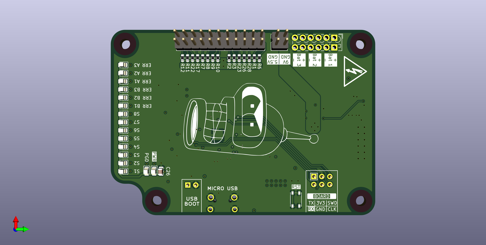
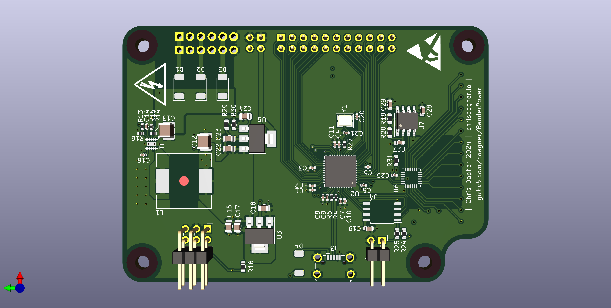
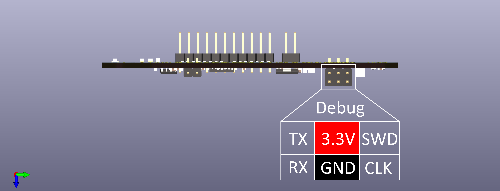

# Bender ARS Power Supply

This repo serves as the home for power supply designs for the Bender Autonomous Robotic Systems (ARS) project at Boise State University. It contains hardware source files including schematics and PCB layout, as well as all firmware source files.

This source is provided as is, with no warranty whatsoever. Feel free to use it in your own projects, so long as you follow the [licensing terms](LICENSE).

## Hardware

We wanted our hardware to be flexible, as requirements can change from year to year depending on the goals of our team, design of the robot, and the competition we are targeting. As a result of this, we determined that our power supply should be *modular*. I don't mean modular like a modular ATX power supply, I mean that we can put in almost any power source, and get almost any supply voltages and currents on the output. This is obviously a tall order, so we settled for an input voltage of 0~60 VDC, a switching capacity of 55 A, and having three replaceable power modules. These modules should be cold-swappable, and can be designed to output nearly any voltage and current within a set power budget. As a final piece, we gave the board three hot-swappable power inputs so that we can power it from multiple batteries or power supplies simultaneously if we want to.

Currently, our power supply is split into three parts as follows:

1. A switching board which handles up to three inputs which are digitally fused to handle things like over-current, under- and over-voltage conditions, brown-outs, over-temperature conditions. Just to name a few. There are also three slots for our replaceable power modules, and one bank of output terminals for motor drivers directly from the input voltage.

2. A series of power modules which fit into a "standard" socket. We made a standard for ourselves from off the shelf connectors such that the modules will sit flush with the switching board, in case we need to give them a heatsink.

3. A controller. Our digital fuses on the inputs and power modules communicate over PMBus, so we need a way of controlling and coordinating everything. As long as the controller fits the bolt pattern and shape specified, it will easily bolt on to the top of the switching board and connect to everything with a wire harness. The decision to break this out into a separate board also simplified design and routing on the switching baord, and allowed for it to be designed for a cheaper 2-layer manufacturing process.

Renderings of the various boards can be seen below.

**Switching Board**

Top view of the switching board

Bottom view of the switching board

**Power Module Examples**

TODO

**Controller**

Top view of the controller PCB

Bottom View of the controller PCB

Side view of the controller PCB

## Firmware
TODO